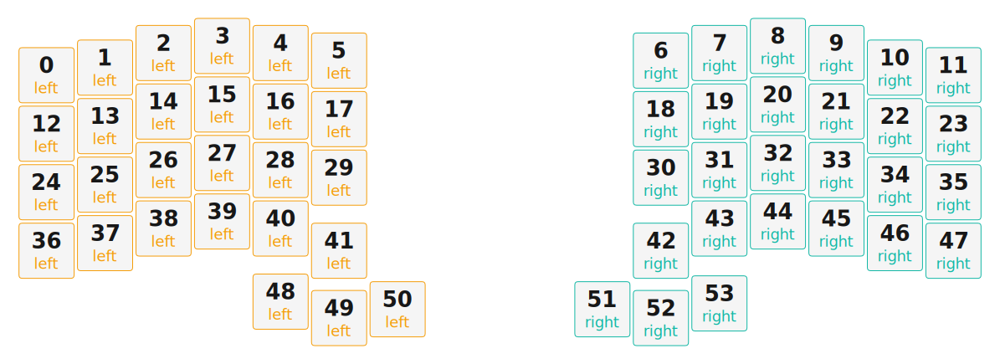

# ZMK Configuration for OrcishCrafts1

*Generated by Shield Wizard for ZMK*



Download compiled firmware from the Actions tab. <https://zmk.dev/docs/user-setup#installing-the-firmware>

Edit your keymap <https://zmk.dev/docs/keymaps>.
User keymap is located at [`config/orcishcrafts1.keymap`](config/orcishcrafts1.keymap).

-----

<details>
<summary>
Shield Wizard Debug Information
</summary>

In case of broken configuration, here is the Shield Wizard internal data used to generate this configuration:

Commit: 63ab9b7bd8845252979f45da72f40210b0b1a3ae

```json
{"name":"OrcishCrafts1","shield":"orcishcrafts1","dongle":false,"modules":[],"layout":[{"id":"01KTY096ARF3F9Y5GB2XE300GZ","part":0,"row":0,"col":0,"w":1,"h":1,"x":0,"y":0.5,"r":0,"rx":0,"ry":0},{"id":"01KTY096ARXVFJYBQFRQDT4PR5","part":0,"row":0,"col":1,"w":1,"h":1,"x":1,"y":0.37,"r":0,"rx":0,"ry":0},{"id":"01KTY096AR8QRAK1BBR9BBDKN7","part":0,"row":0,"col":2,"w":1,"h":1,"x":2,"y":0.12,"r":0,"rx":0,"ry":0},{"id":"01KTY096ARF1Y2KXETHBG1M2JD","part":0,"row":0,"col":3,"w":1,"h":1,"x":3,"y":0,"r":0,"rx":0,"ry":0},{"id":"01KTY096ARBQKJ7ZPTP55ZF23D","part":0,"row":0,"col":4,"w":1,"h":1,"x":4,"y":0.12,"r":0,"rx":0,"ry":0},{"id":"01KTY096ARG4CJ0T6M8P0QFKWZ","part":0,"row":0,"col":5,"w":1,"h":1,"x":5,"y":0.25,"r":0,"rx":0,"ry":0},{"id":"01KTY096ARZNF8BC8ABX9J2VW1","part":1,"row":0,"col":8,"w":1,"h":1,"x":10.5,"y":0.25,"r":0,"rx":0,"ry":0},{"id":"01KTY096ARVW1VM0YSCV2ZB3SX","part":1,"row":0,"col":9,"w":1,"h":1,"x":11.5,"y":0.12,"r":0,"rx":0,"ry":0},{"id":"01KTY096AR4VNQ36TXFXBRRCSA","part":1,"row":0,"col":10,"w":1,"h":1,"x":12.5,"y":0,"r":0,"rx":0,"ry":0},{"id":"01KTY096AREFHSS3W5ZSWHDN9G","part":1,"row":0,"col":11,"w":1,"h":1,"x":13.5,"y":0.12,"r":0,"rx":0,"ry":0},{"id":"01KTY096ARAMWNNVE4C9CAV6P2","part":1,"row":0,"col":12,"w":1,"h":1,"x":14.5,"y":0.37,"r":0,"rx":0,"ry":0},{"id":"01KTY096ARGGZWQE3MHGJDPQSJ","part":1,"row":0,"col":13,"w":1,"h":1,"x":15.5,"y":0.5,"r":0,"rx":0,"ry":0},{"id":"01KTY096ARY1V2X46CG08ECTD2","part":0,"row":1,"col":0,"w":1,"h":1,"x":0,"y":1.5,"r":0,"rx":0,"ry":0},{"id":"01KTY096ARCEJ5NH843QWNRWZ2","part":0,"row":1,"col":1,"w":1,"h":1,"x":1,"y":1.37,"r":0,"rx":0,"ry":0},{"id":"01KTY096AR15P4EWE2H56BV5J0","part":0,"row":1,"col":2,"w":1,"h":1,"x":2,"y":1.12,"r":0,"rx":0,"ry":0},{"id":"01KTY096ARKN22H43YYV755S8R","part":0,"row":1,"col":3,"w":1,"h":1,"x":3,"y":1,"r":0,"rx":0,"ry":0},{"id":"01KTY096AR44FP9VKYAAR1Z61K","part":0,"row":1,"col":4,"w":1,"h":1,"x":4,"y":1.12,"r":0,"rx":0,"ry":0},{"id":"01KTY096ARHZH8W410KBPYPZH6","part":0,"row":1,"col":5,"w":1,"h":1,"x":5,"y":1.25,"r":0,"rx":0,"ry":0},{"id":"01KTY096ARASJPJD9XRDRCSHWK","part":1,"row":1,"col":8,"w":1,"h":1,"x":10.5,"y":1.25,"r":0,"rx":0,"ry":0},{"id":"01KTY096AS6SB0CRM3BVXYF1EV","part":1,"row":1,"col":9,"w":1,"h":1,"x":11.5,"y":1.12,"r":0,"rx":0,"ry":0},{"id":"01KTY096ASZT4EP9NA6TXQP7YX","part":1,"row":1,"col":10,"w":1,"h":1,"x":12.5,"y":1,"r":0,"rx":0,"ry":0},{"id":"01KTY096AS2QKA04GFQKNP4PK4","part":1,"row":1,"col":11,"w":1,"h":1,"x":13.5,"y":1.12,"r":0,"rx":0,"ry":0},{"id":"01KTY096ASE1ZV4CAE8YSBERDE","part":1,"row":1,"col":12,"w":1,"h":1,"x":14.5,"y":1.37,"r":0,"rx":0,"ry":0},{"id":"01KTY096ASYEG7VJJ5GVHG4R72","part":1,"row":1,"col":13,"w":1,"h":1,"x":15.5,"y":1.5,"r":0,"rx":0,"ry":0},{"id":"01KTY096AS22DHRA20AW5QFEJ9","part":0,"row":2,"col":0,"w":1,"h":1,"x":0,"y":2.5,"r":0,"rx":0,"ry":0},{"id":"01KTY096ASKNQ3EZ68GY2YKXZY","part":0,"row":2,"col":1,"w":1,"h":1,"x":1,"y":2.37,"r":0,"rx":0,"ry":0},{"id":"01KTY096ASSSR2R0G8V18FX783","part":0,"row":2,"col":2,"w":1,"h":1,"x":2,"y":2.12,"r":0,"rx":0,"ry":0},{"id":"01KTY096ASPT6BVGMADSY93F2J","part":0,"row":2,"col":3,"w":1,"h":1,"x":3,"y":2,"r":0,"rx":0,"ry":0},{"id":"01KTY096AS21CX92VVKG72V0KJ","part":0,"row":2,"col":4,"w":1,"h":1,"x":4,"y":2.12,"r":0,"rx":0,"ry":0},{"id":"01KTY096ASBRM6A64PMPT276VW","part":0,"row":2,"col":5,"w":1,"h":1,"x":5,"y":2.25,"r":0,"rx":0,"ry":0},{"id":"01KTY096ASHYH0P0JGDBFQ7PWV","part":1,"row":2,"col":8,"w":1,"h":1,"x":10.5,"y":2.25,"r":0,"rx":0,"ry":0},{"id":"01KTY096ASZ5Z188WWAXCR9JMA","part":1,"row":2,"col":9,"w":1,"h":1,"x":11.5,"y":2.12,"r":0,"rx":0,"ry":0},{"id":"01KTY096ASQHQE6ETHSETJGXY6","part":1,"row":2,"col":10,"w":1,"h":1,"x":12.5,"y":2,"r":0,"rx":0,"ry":0},{"id":"01KTY096ASXFK8J154RVPHP1NE","part":1,"row":2,"col":11,"w":1,"h":1,"x":13.5,"y":2.12,"r":0,"rx":0,"ry":0},{"id":"01KTY096ATT7V5PGX4YF3H9E6N","part":1,"row":2,"col":12,"w":1,"h":1,"x":14.5,"y":2.37,"r":0,"rx":0,"ry":0},{"id":"01KTY096AT7XXGSFEJMN9EMCX7","part":1,"row":2,"col":13,"w":1,"h":1,"x":15.5,"y":2.5,"r":0,"rx":0,"ry":0},{"id":"01KTY096ATSEQYG2R3XNXJN8QE","part":0,"row":3,"col":0,"w":1,"h":1,"x":0,"y":3.5,"r":0,"rx":0,"ry":0},{"id":"01KTY096AT2AE6SC11CQ5D7QKK","part":0,"row":3,"col":1,"w":1,"h":1,"x":1,"y":3.37,"r":0,"rx":0,"ry":0},{"id":"01KTY096ATFK7M93QMBVK0RSD9","part":0,"row":3,"col":2,"w":1,"h":1,"x":2,"y":3.12,"r":0,"rx":0,"ry":0},{"id":"01KTY096AT0GWC91AN0HACN37A","part":0,"row":3,"col":3,"w":1,"h":1,"x":3,"y":3,"r":0,"rx":0,"ry":0},{"id":"01KTY096AT1KAK0FTEAMH15MHX","part":0,"row":3,"col":4,"w":1,"h":1,"x":4,"y":3.12,"r":0,"rx":0,"ry":0},{"id":"01KTY096ATXAECGGMT8M6Y8R98","part":0,"row":3,"col":5,"w":1,"h":1,"x":5,"y":3.5,"r":0,"rx":0,"ry":0},{"id":"01KTY096ATF2Q0GJ7Z10RDCZDD","part":1,"row":3,"col":8,"w":1,"h":1,"x":10.5,"y":3.5,"r":0,"rx":0,"ry":0},{"id":"01KTY096AT4SPQADQJ1N3F873Y","part":1,"row":3,"col":9,"w":1,"h":1,"x":11.5,"y":3.12,"r":0,"rx":0,"ry":0},{"id":"01KTY096ATGE13CNAE9Z3X9BK6","part":1,"row":3,"col":10,"w":1,"h":1,"x":12.5,"y":3,"r":0,"rx":0,"ry":0},{"id":"01KTY096ATPDA427M28VREWFWJ","part":1,"row":3,"col":11,"w":1,"h":1,"x":13.5,"y":3.12,"r":0,"rx":0,"ry":0},{"id":"01KTY096ATXFS28R3FADNS02C3","part":1,"row":3,"col":12,"w":1,"h":1,"x":14.5,"y":3.37,"r":0,"rx":0,"ry":0},{"id":"01KTY096ATPFTVWHR671W3RMC8","part":1,"row":3,"col":13,"w":1,"h":1,"x":15.5,"y":3.5,"r":0,"rx":0,"ry":0},{"id":"01KTY096ATYGW4G423JJC4SPXV","part":0,"row":4,"col":3,"w":1,"h":1,"x":4,"y":4.37,"r":0,"rx":0,"ry":0},{"id":"01KTY096ATDJPP3647F7M8VXFM","part":0,"row":4,"col":4,"w":1,"h":1,"x":5,"y":4.65,"r":0,"rx":0,"ry":0},{"id":"01KTY096ATJEEJPYAH5613CMMC","part":0,"row":4,"col":5,"w":1,"h":1,"x":6,"y":4.5,"r":0,"rx":0,"ry":0},{"id":"01KTY096ATGNZQ7C1GYWY2XWMP","part":1,"row":4,"col":8,"w":1,"h":1,"x":9.5,"y":4.5,"r":0,"rx":0,"ry":0},{"id":"01KTY096ATM13YJCJGK6KPWFGK","part":1,"row":4,"col":9,"w":1,"h":1,"x":10.5,"y":4.65,"r":0,"rx":0,"ry":0},{"id":"01KTY096ATYGDF1SJ15RTQ9X32","part":1,"row":4,"col":10,"w":1,"h":1,"x":11.5,"y":4.4,"r":0,"rx":0,"ry":0}],"parts":[{"name":"left","controller":"nice_nano_v2","wiring":"matrix_diode","pins":{"d21":"input","d20":"input","d19":"input","d18":"input","d15":"input","d14":"output","d16":"output","d10":"output","d9":"output","d8":"output","d6":"output"},"keys":{"01KTY096ARF3F9Y5GB2XE300GZ":{"input":"d21","output":"d6"},"01KTY096ARXVFJYBQFRQDT4PR5":{"input":"d21","output":"d8"},"01KTY096AR8QRAK1BBR9BBDKN7":{"input":"d21","output":"d9"},"01KTY096ARF1Y2KXETHBG1M2JD":{"input":"d21","output":"d10"},"01KTY096ARBQKJ7ZPTP55ZF23D":{"input":"d21","output":"d16"},"01KTY096ARG4CJ0T6M8P0QFKWZ":{"input":"d21","output":"d14"},"01KTY096ARY1V2X46CG08ECTD2":{"input":"d20","output":"d6"},"01KTY096ARCEJ5NH843QWNRWZ2":{"input":"d20","output":"d8"},"01KTY096AR15P4EWE2H56BV5J0":{"input":"d20","output":"d9"},"01KTY096ARKN22H43YYV755S8R":{"input":"d20","output":"d10"},"01KTY096AR44FP9VKYAAR1Z61K":{"input":"d20","output":"d16"},"01KTY096ARHZH8W410KBPYPZH6":{"input":"d20","output":"d14"},"01KTY096AS22DHRA20AW5QFEJ9":{"input":"d19","output":"d6"},"01KTY096ASKNQ3EZ68GY2YKXZY":{"input":"d19","output":"d8"},"01KTY096ASPT6BVGMADSY93F2J":{"input":"d19","output":"d10"},"01KTY096ASSSR2R0G8V18FX783":{"input":"d19","output":"d9"},"01KTY096AS21CX92VVKG72V0KJ":{"input":"d19","output":"d16"},"01KTY096ASBRM6A64PMPT276VW":{"input":"d19","output":"d14"},"01KTY096ATSEQYG2R3XNXJN8QE":{"input":"d18","output":"d6"},"01KTY096AT2AE6SC11CQ5D7QKK":{"input":"d18","output":"d8"},"01KTY096ATFK7M93QMBVK0RSD9":{"input":"d18","output":"d9"},"01KTY096AT0GWC91AN0HACN37A":{"input":"d18","output":"d10"},"01KTY096ATXAECGGMT8M6Y8R98":{"input":"d18","output":"d14"},"01KTY096AT1KAK0FTEAMH15MHX":{"input":"d18","output":"d16"},"01KTY096ATYGW4G423JJC4SPXV":{"input":"d15","output":"d10"},"01KTY096ATDJPP3647F7M8VXFM":{"input":"d15","output":"d16"},"01KTY096ATJEEJPYAH5613CMMC":{"input":"d15","output":"d14"}},"encoders":[],"buses":[{"name":"spi0","devices":[],"type":"spi"},{"name":"spi1","devices":[],"type":"spi"},{"name":"spi2","devices":[],"type":"spi"},{"name":"spi3","devices":[],"type":"spi"},{"name":"i2c0","devices":[],"type":"i2c"},{"name":"i2c1","devices":[],"type":"i2c"}]},{"name":"right","controller":"nice_nano_v2","wiring":"matrix_diode","pins":{"d21":"input","d20":"input","d19":"input","d18":"input","d15":"input","d14":"output","d16":"output","d10":"output","d9":"output","d8":"output","d6":"output"},"keys":{"01KTY096ARZNF8BC8ABX9J2VW1":{"input":"d21","output":"d14"},"01KTY096ARVW1VM0YSCV2ZB3SX":{"input":"d21","output":"d16"},"01KTY096AR4VNQ36TXFXBRRCSA":{"input":"d21","output":"d10"},"01KTY096AREFHSS3W5ZSWHDN9G":{"input":"d21","output":"d9"},"01KTY096ARAMWNNVE4C9CAV6P2":{"input":"d21","output":"d8"},"01KTY096ARGGZWQE3MHGJDPQSJ":{"input":"d21","output":"d6"},"01KTY096ARASJPJD9XRDRCSHWK":{"input":"d20","output":"d14"},"01KTY096AS6SB0CRM3BVXYF1EV":{"input":"d20","output":"d16"},"01KTY096ASZT4EP9NA6TXQP7YX":{"input":"d20","output":"d10"},"01KTY096AS2QKA04GFQKNP4PK4":{"input":"d20","output":"d9"},"01KTY096ASE1ZV4CAE8YSBERDE":{"input":"d20","output":"d8"},"01KTY096ASYEG7VJJ5GVHG4R72":{"input":"d20","output":"d6"},"01KTY096ASHYH0P0JGDBFQ7PWV":{"input":"d19","output":"d14"},"01KTY096ASZ5Z188WWAXCR9JMA":{"input":"d19","output":"d16"},"01KTY096ASQHQE6ETHSETJGXY6":{"input":"d19","output":"d10"},"01KTY096ASXFK8J154RVPHP1NE":{"input":"d19","output":"d9"},"01KTY096ATT7V5PGX4YF3H9E6N":{"input":"d19","output":"d8"},"01KTY096AT7XXGSFEJMN9EMCX7":{"input":"d19","output":"d6"},"01KTY096ATF2Q0GJ7Z10RDCZDD":{"input":"d18","output":"d14"},"01KTY096AT4SPQADQJ1N3F873Y":{"input":"d18","output":"d16"},"01KTY096ATGE13CNAE9Z3X9BK6":{"input":"d18","output":"d10"},"01KTY096ATPDA427M28VREWFWJ":{"input":"d18","output":"d9"},"01KTY096ATXFS28R3FADNS02C3":{"input":"d18","output":"d8"},"01KTY096ATPFTVWHR671W3RMC8":{"input":"d18","output":"d6"},"01KTY096ATGNZQ7C1GYWY2XWMP":{"input":"d15","output":"d14"},"01KTY096ATM13YJCJGK6KPWFGK":{"input":"d15","output":"d16"},"01KTY096ATYGDF1SJ15RTQ9X32":{"input":"d15","output":"d10"}},"encoders":[],"buses":[{"name":"spi0","devices":[],"type":"spi"},{"name":"spi1","devices":[],"type":"spi"},{"name":"spi2","devices":[],"type":"spi"},{"name":"spi3","devices":[],"type":"spi"},{"name":"i2c0","devices":[],"type":"i2c"},{"name":"i2c1","devices":[],"type":"i2c"}]}]}
```

</details>
